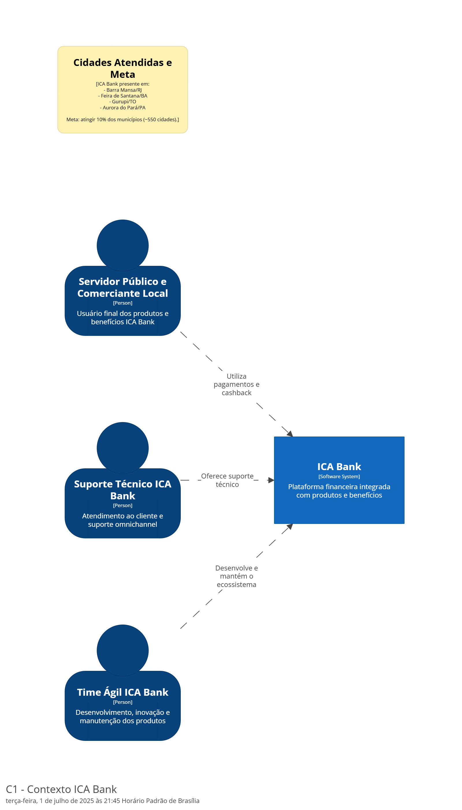
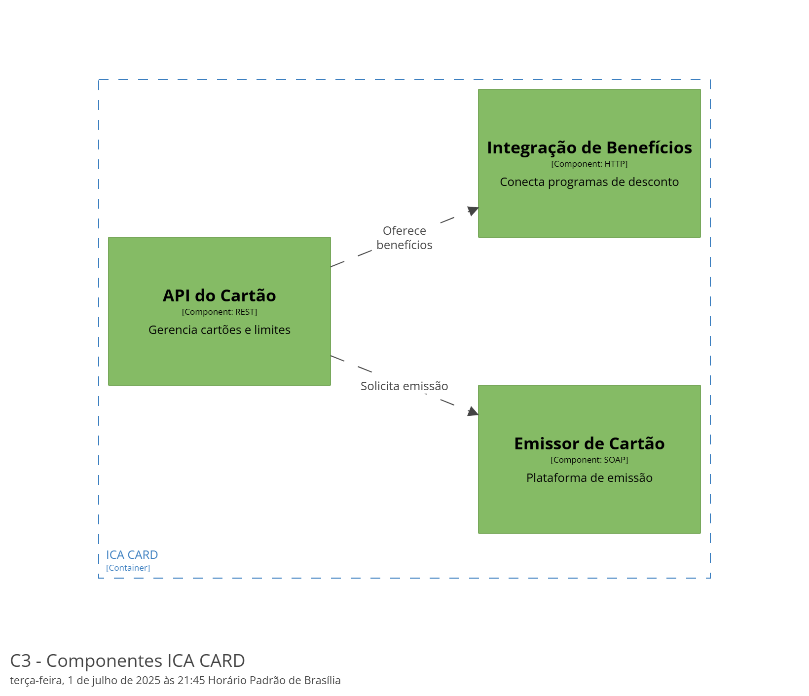
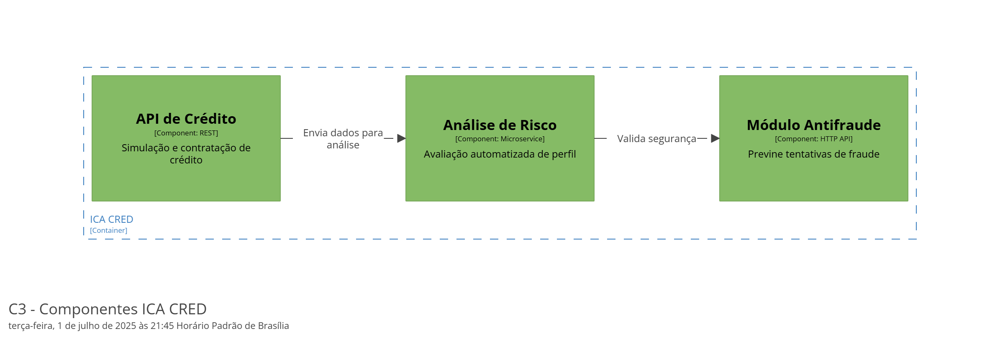
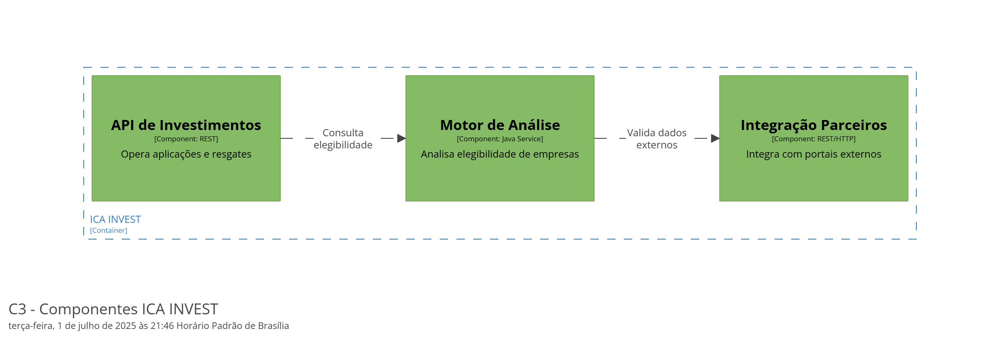
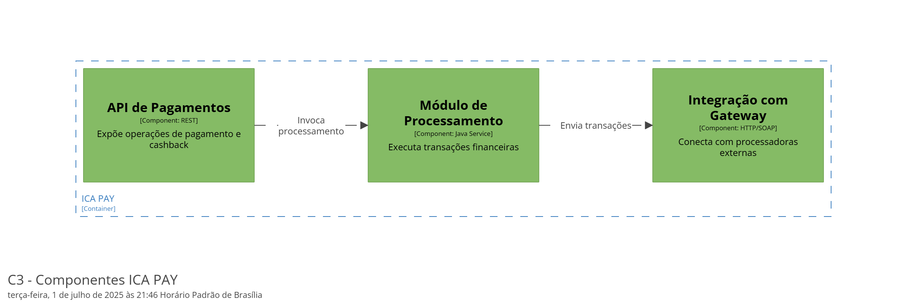

# 🏦 ICA BANK - Visão Geral, Estrutura Ágil, Produtos e Presença Nacional

---

## 🎯 **Propósito e Organização do ICA Bank**

O ICA Bank oferece soluções financeiras completas, com foco em inovação, benefícios para servidores públicos e integração de produtos financeiros robustos. A atuação é sustentada por excelência operacional, práticas ágeis e times escaláveis, baseando-se no Manifesto Ágil e nos melhores padrões de estruturação organizacional.

---

# 🚀 **Produtos e Benefícios do ICA Bank**

| Produto/Serviço | Descrição                                                      |
| --------------- | -------------------------------------------------------------- |
| **ICA PAY**     | Plataforma de pagamentos e cashback para clientes e parceiros. |
| **ICA INVEST**  | Investimentos P2P em Micro e Pequenas Empresas brasileiras.    |
| **ICA CRED**    | Crédito rápido e descomplicado para pessoa física.             |
| **ICA CARD**    | Cartão de crédito com benefícios e descontos exclusivos.       |

**Benefícios Adicionais:**

* ICA Mais Saúde (Descontos em saúde)
* ICA Telemedicina (Atendimento remoto de saúde)
* Seguro de Vida
* Auxílios Financeiros diversos
* Plano Odontológico
* WinCupom (Programa de Cupons e Descontos)
* Auxílio Pet

---

# 🏙️ **Cidades com Atuação Confirmada do ICA Bank**

Embora ainda não exista uma lista pública e oficial completa divulgada pela fintech, fontes públicas e reportagens apontam atuação confirmada nas seguintes cidades:

| Estado | Cidade           | Detalhes do Serviço                                  |
| ------ | ---------------- | ---------------------------------------------------- |
| RJ     | Barra Mansa      | Cartão do Servidor com antecipação salarial          |
| BA     | Feira de Santana | Salarial Card para antecipação de salário            |
| TO     | Gurupi           | Cartão de antecipação salarial e fomento ao comércio |
| PA     | Aurora do Pará   | Cartão de benefícios para servidores municipais      |

---

# 🌐 **Expansão e Meta Nacional**

✔️ Presente em mais de **40 cidades brasileiras**
✔️ Meta: atingir **10% dos municípios do Brasil** (∼550 cidades)
✔️ Objetivo de abrir unidades físicas em até **120 municípios**, priorizando:

* Parcerias com seguradoras
* Ofertas de benefícios de saúde e qualidade de vida
* Incentivo ao comércio local
* Fortalecimento da economia dos servidores públicos

---

# 🔎 **Como Consultar as Cidades Atendidas**

Para informações atualizadas sobre as cidades e serviços disponíveis:

✅ Site oficial: [https://icabank.com.br](https://icabank.com.br)
✅ Canais de atendimento e suporte do ICA Bank
✅ Consulta à prefeitura local sobre parcerias vigentes

---

# 📋 **Kanban Unificado - Fluxo Ágil ICA Bank**

```
[Backlog] → [To Do] → [In Progress] → [Code Review/Testes] → [Aguardando Aprovação] → [Done]
```

**Volume médio de Tasks por Produto:**

| Produto           | Volume Aproximado de Tasks/Mês |
| ----------------- | ------------------------------ |
| ICA PAY           | 20 tasks                       |
| ICA INVEST        | 15 tasks                       |
| ICA CRED          | 10 tasks                       |
| ICA CARD          | 18 tasks                       |
| Benefícios Extras | 12 tasks                       |

**SLA de Suporte ao Cliente:**

* Atendimento omnichannel integrado
* Resposta em até **24h** para dúvidas básicas e suporte inicial
* Resolução técnica avançada ou onboarding em até **48h**
* Monitoramento contínuo de incidentes **24x7**

---

# 👥 **Estrutura Recomendada - Times e Tribes do ICA Bank**

## **Estágio 1 - Squad Mínimo por Produto**

* Product Owner (PO)
* Scrum Master
* 2 Dev Backend
* 2 Dev Frontend/Mobile
* QA/Testes
* Designer UX/UI
* 2 Suporte Técnico N1/N2 (compartilhado)

**Total: 7 a 9 profissionais por Squad**

---

## **Estágio 2 - Tribe Completa (Escalável)**

* Tribe Lead
* Arquiteto de Soluções
* Chapter Leads técnicos (Backend, Frontend, Dados)
* Especialistas em Segurança e Compliance
* Suporte Centralizado
* Múltiplos Squads: ICA PAY, INVEST, CRED, CARD

**Total: 35 a 50 profissionais**

---

## **Estágio 3 - Tribe de Excelência e Expansão**

* Squads dedicados aos Benefícios Extras (Saúde, Pet, etc)
* Times de Dados e Business Intelligence (BI)
* Núcleos de Inovação: IA, Open Finance, Blockchain
* Governança Corporativa
* Expansão nacional e internacional
* Squads remotos e híbridos

---

# 📊 **Normas de Gestão e Indicadores Ágeis**

* Planejamento quinzenal
* Daily Meetings de 15 minutos
* Retrospectivas mensais de melhoria contínua
* Reviews públicas de entregas e incrementos
* Dashboard Kanban obrigatório e atualizado
* Principais Métricas:

  * Lead Time
  * Cycle Time
  * Percentual de entregas no prazo
  * NPS (Net Promoter Score) dos clientes

---

# 🏁 **Resumo Final**

O ICA Bank posiciona-se como um ecossistema financeiro inovador que:

✔️ Escala produtos com segurança e foco na experiência do cliente
✔️ Garante autonomia dos times e squads
✔️ Alavanca a economia local e o bem-estar dos usuários
✔️ Atua com metas agressivas de expansão municipal e nacional
✔️ Sustenta o crescimento com Tribes de Excelência, Governança e Inovação

**Vamos juntos transformar o mercado financeiro com agilidade, excelência e impacto social!** 🚀

---

# 📈 **C4 Model - ICA Bank Arquitetura Organizacional**

## C1 Context Key


## C1 Contexto Completo



## C2 Containers Key


## C3 Componentes ICA Card




## C3 Componentes ICA Cred




## C3 Componentes ICA Invest




## C3 Componentes ICA Pay



